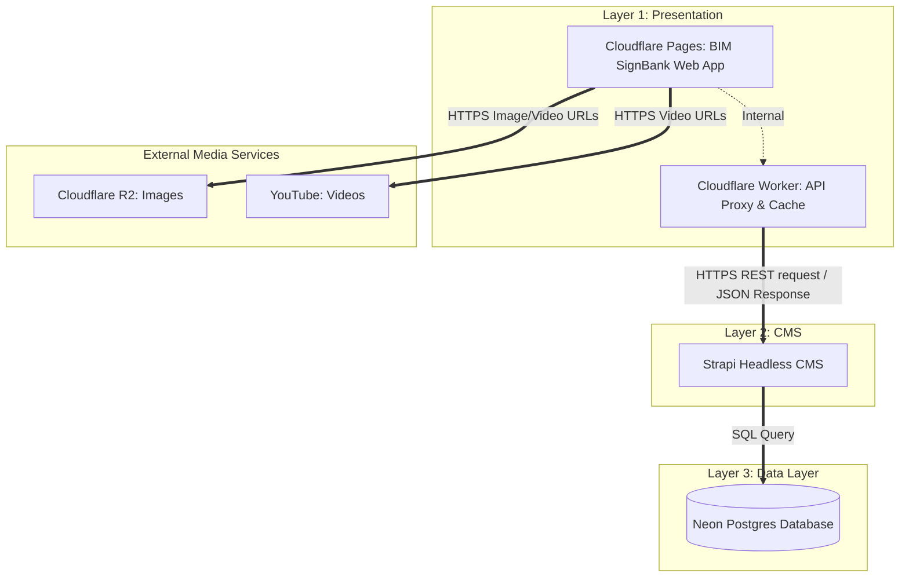

# BIM Sign Bank by MFD

Bahasa Isyarat Malaysia (BIM) is the official [Malaysian Sign Language](https://www.mymfdeaf.org/bahasa-isyarat-malaysia-bim), recognized by the Persons with Disabilities Act 2008 in Malaysia. The [Malaysia Federation of The Deaf (MFD)](https://www.mymfdeaf.org/), a national organization that offers helps and services to the Deaf community in Malaysia, has played a crucial role in the development of BIM since 1997. 

In order to educate and promote the use of BIM, MFD intended to develop a BIM Sign Bank application to provide the official source of reference on the digital platform. As a non-profit organization, MFD needs a simple, sustainable and self-maintainable solution for the Deaf Community in Malaysia, as well as the students, teachers, parents and the general public in the digital age. 

As a "Friend of MFD" and in the spirit of social responsibility, the employees of [Guidewire Software](https://careers.guidewire.com/guidewire-gives-back) have stepped in and volunteered their time to help MFD to develop a simple and easy to maintain web application, and to host it on a sustainable and cost effective platform at [Cloudflare](https://cloudflare.com) for long run. 

## Project Features

The project consists of fundamental features that support the objective of education and official source of reference for BIM.

## Visual Architecture Diagram

## Technology Stack Details

The system is broken down into modular layers, ensuring each component handles a specific domain efficiently.

| Layer / Domain            | Technology           | Role & Description                                                                                                                                                 |
| :------------------------ | :------------------- | :----------------------------------------------------------------------------------------------------------------------------------------------------------------- |
| _Presentation (Layer 1)_  | _Cloudflare Pages_   | Hosts the React-based frontend web application. Replaces Vercel for better integration with the edge network.                                                      |
| _Proxy & Cache (Layer 1)_ | _Cloudflare Workers_ | Sits between the web app and the CMS. Catches REST API requests, checks for cached JSON, and serves it instantly. If not cached, it proxies the request to Strapi. |
| _Content Mgmt (Layer 2)_  | _Strapi_             | The headless Content Management System. Provides the REST API for BIM signs, categories, and structural data.                                                      |
| _Data Layer (Layer 3)_    | _Neon Database_      | Serverless Postgres database. Stores all structured textual data and relationships queried by Strapi.                                                              |
| _Image Hosting (Ext)_     | _Cloudflare R2_      | Zero-egress fee object storage. Delivers all BIM sign images quickly via Cloudflare's global CDN.                                                                  |
| _Video Hosting (Ext)_     | _YouTube_            | Hosts and streams sign demonstration videos, reducing bandwidth costs and ensuring reliable video playback.                                                        |

## Authentication & Access Control (Security Model)

**App model**: The application is a fully public, read-only platform by design. It deliberately has **no authentication**, user sessions, or protected routes, as all dictionary and educational content is strictly public.

**Hosting Model**: The frontend is hosted on Cloudflare Pages, with assets in R2, and a Strapi backend (hosted on Render or equivalent). All front-end routes and API routes consumed by the app are fully public and read-only.

**Design Risk & Contributor Rules**: Future contributors must understand this read-only intent. If any new write operations (e.g., `POST`, `PUT`, `PATCH`, `DELETE`) are introduced to the frontend application or backend APIs, the contributor **must**:

## Caching & Data Management

### Edge Caching (Cloudflare Worker – Primary Layer)

The primary caching mechanism for BIM SignBank is handled at the **edge** via a Cloudflare Worker that proxies requests to Strapi.

- **Where it runs:** Cloudflare Worker in front of the Strapi API domain (e.g. `api.<domain>.com`).
- **What is cached:** Public, read-only **GET** responses from Strapi (e.g. `/api/bims`, `/api/category-groups`, alphabet and category queries).
- **Behaviour:**
  - Cache entries are keyed by the full request URL (path + query string, including locale, filters, etc.).
  - Responses are cached for a short TTL (e.g. a few minutes to a couple of hours, depending on config).
  - Subsequent identical GETs are served from the Cloudflare edge cache without hitting Strapi/DB.
- **Benefits:**
  - Significantly reduces load on Strapi and the database for popular vocab lists and searches.
  - Improves response time for users globally by serving from edge locations.
  - Keeps the frontend simple (no complex client-side caching required for read-only traffic).

For detailed Worker behaviour (CORS headers, TTL, paths cached, etc.), see the Strapi proxy Worker documentation in this repo’s docs.

## Installation Guide

### Pre-Installation:

- Due to a package dependency, installation of Visual Studio C++ Development Workload through the Visual Studio Build Tools is necessary.
- Ensure that your device has Node.js installed by typing `node -v` in the command prompt. Npm will be automatically included with Node.js.
- Npm version can be checked with `npm -v`.
- The recomended IDE for this project is Visual Studio Code.
- The recommended extensions for this project are as follows:
  - ES7 React/Redux/GraphQL/React-Native snippets
  - Prettier - Code formatter
    - To automatically format file on save, go to settings.json and add the following line: `"editor.formatOnSave": true`
  - React Extension Pack
  - Git Easy
  - Auto-Save on Window Change

### Installation:

- Clone the project repository.
- Run `npm install` in the terminal to install the required node modules.
- Copy the `.env.example` file to a new file named `.env.local` and fill in the actual environment variable values.
- Run `npm start` in the terminal to start the development server.